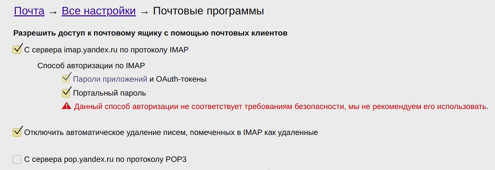
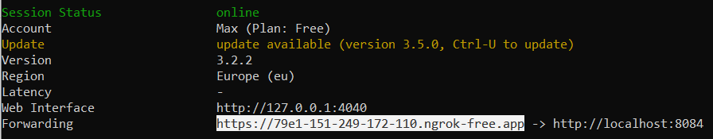
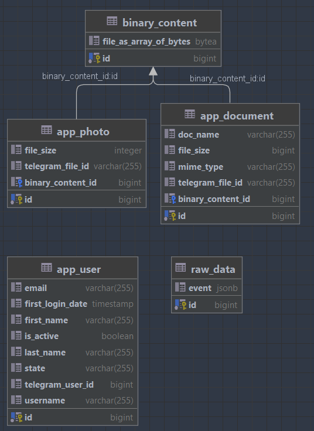

# File Storage Bot
* REST application that provides external data storage functionality through Telegram.
* Created for learning purposes. 

## Requirements
* JDK 17
* Apache Maven 3.6.3
* Docker Desktop

## Tech stack
* Spring 
  * Boot 3
  * Data (JPA / Hibernate)
* Databases
  * PostgreSQL
* Containerisation
  * Docker
* Queues
  * RabbitMQ
* Telegram API

  
## Installation
Clone repository form GitHub.
```shell
git clone https://github.com/1aazy/FileStorageBot.git
```

Create your own bot with BotFather, obtain your API token and fill out the application.properties files.
```shell
dispatcher:
  bot.name= enter bot name
  bot.token= enter token
node:
  token= enter token
```

Also create your own "salt" to encode id of documents and write it into the application.properties files.

```shell
node:
  salt=enter salt
rest-service:
  salt=enter salt
```

## Getting the project up and running
Download the RabbitMQ image:
```shell
docker pull rabbitmq:3.11.0-management
```

Create volume:
```shell
docker volume create rabbitmq_data
```

Start rabbitmq container:
```shell
docker run -d --hostname rabbitmq --name rabbitmq -p 5672:5672 -p 15672:15672 -v rabbitmq_data/:rabbitmq_data --restart=unless-stopped rabbitmq:3.11.0-management
```

Then connect to docker container:
```shell
docker exec -it rabbitmq /bin/bash
```

Create new user in RabbitMQ:
```shell
rabbitmqctl add_user userok p@ssw0rd
rabbitmqctl set_user_tags userok administrator
rabbitmqctl set_permissions -p / userok ".*" ".*" ".*"
```

Create container for PostgreSQL:
```shell
docker run -d --hostname pogreb --name pogreb -p 5432:5432 -e POSTGRES_USER=userok -e POSTGRES_PASSWORD=p@ssw0rd -e POSTGRES_DB=pogreb -v /data:/var/lib/docker/volumes/postgresql/_data --restart=unless-stopped postgres:14.5
```

To enable the registration function, you need to create an email address for sending emails to complete registration:

</br>And write email settings to the applications.properties file:
```shell
mail-service:
  spring.mail.username= enter yandex mail
  spring.mail.password= enter yandex mail password
```

To localy start bot you need to install Ngrok:
https://ngrok.com/download

Register and start program.
After starting just put this command into cmd:
```shell
ngrok http 8084
```

You will receive static IP address (Forwarding line) that needs to start your bot


Copy and paste this IP address into the application.properties file.
```shell
dispatcher:
  bot.uri= ngrok static IP for local running
```

## Database structure



